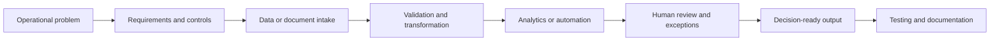

# Operations Analytics & Automation Case Studies

A privacy-safe index of analytics, workflow, and automation projects delivered across regulated operations and personal portfolio work.

This repository documents the problem-solving approach, architecture, validation, and delivery lessons without publishing employer/client records, personal data, internal process controls, protected branding, or proprietary source files.

## Portfolio map

| Case study | Evidence status | Portfolio treatment |
|---|---|---|
| Contact-centre reporting automation | Completed artifacts verified locally | Generic architecture and lessons only |
| Grant risk and capacity analytics | Completed dashboards/reports verified locally | Fictionalised methodology only |
| PSV17 OCR and human-review pipeline | Working source verified | [Sanitised code repository](https://github.com/OzzyPyrex/psv17-builder) |
| Office football sweepstake | Public deployment reviewed; original source not recovered | [Portfolio-safe reconstruction](https://github.com/OzzyPyrex/football-sweepstake-dashboard) |
| Licence-renewal workflow design | Delivery described in CV; original diagram/source unavailable | Generic workflow pattern only |
| Browser PDF editor proof of concept | Functional prototype described in CV; original source unavailable | Security-conscious concept note only |
| AI-assisted job-search workflow | Working files and scheduled workflow verified | [Sanitised tracker repository](https://github.com/OzzyPyrex/AI-Assisted-Job-Search-Tracker) |
| Print-ready research-poster QA pipeline | Working scripts and final QA outputs verified | Rebuild required with fictional content |
| ATS document-generation workflow | Working scripts and rendered documents verified | Rebuild required with templates and fictional data |

## Case studies

- [Contact-centre reporting automation](docs/contact-centre-reporting.md)
- [Grant risk and capacity analytics](docs/grant-risk-analytics.md)
- [Licence-renewal workflow design](docs/licence-renewal-workflow.md)
- [Browser PDF editor proof of concept](docs/browser-pdf-editor.md)
- [Additional automation work](docs/additional-automation.md)
- [Evidence and publication boundaries](docs/evidence-register.md)

## Core delivery pattern

Across the portfolio, the recurring design principles are:

- Build traceable transformations rather than opaque one-off calculations.
- Validate totals, categories, and exceptions before presenting results.
- Route uncertainty to a human instead of silently forcing an automated decision.
- Separate demonstration data from operational data.
- Document assumptions, limitations, and ownership boundaries.

## Privacy and intellectual-property boundary

The original SGS/NTA dashboards, spreadsheets, reports, applicant records, contact identifiers, employee performance data, branding, and internal process materials are deliberately excluded. This repository is not affiliated with or endorsed by SGS, NTA, FIFA, or any other named organisation.

No open-source licence is granted unless a licence file is added later.
