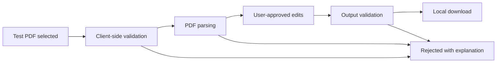

# Browser PDF Editor — Proof of Concept

**Evidence status:** A functional prototype using test documents is documented in the user's project CV. The original HTML/JavaScript source was not found during the portfolio audit.

This is a concept note, not recovered source code.

## Intended purpose

The proof of concept explored whether common PDF-editing tasks could be completed through a simple browser interface, reducing repeated desktop-tool steps in a document workflow.

## Safe product boundary

A responsible implementation would need:

- Local-only processing by default
- No silent upload of documents
- Clear supported-file and file-size limits
- Explicit handling of encrypted or malformed PDFs
- Redaction that removes content rather than merely covering it visually
- Metadata removal where required
- Audit-friendly success and failure messages
- Formal security, privacy, retention, and accessibility review

## Generic architecture

## Publication boundary

No internal documents or workflow-specific rules should be used in a rebuild. Until source is recovered or recreated, the portfolio should describe this as a completed proof of concept whose original implementation is unavailable—not as an active production system.

