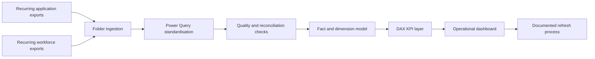

# Contact-Centre Reporting Automation

**Evidence status:** Completed Power BI artifacts and recurring source structure verified locally. Original data and report files are intentionally excluded.

## Problem

Recurring application-performance and workforce exports needed to become a consistent view of service demand, answering performance, delays, abandonment, handling activity, and workforce utilisation.

Manual monthly consolidation created familiar risks: mismatched columns, inconsistent categories, duplicated work, unclear KPI definitions, and a fragile refresh process.

## Solution pattern

The implemented approach used reusable folder-based ingestion, standardised fields, model relationships, defined KPIs, refresh logic, and management-facing Power BI views.

## Analytical areas

- Offered, answered, and abandoned demand
- Service level and answer rate
- Queue delay and short-call patterns
- Demand by period
- Logged-in and active time
- Talk, ring, idle, break, and not-ready activity
- Calls handled per productive hour
- Trend and exception monitoring

## Validation approach

- Reconcile transformed totals to each source period.
- Check missing and unexpected category values.
- Validate duration units before combining measures.
- Distinguish service demand from workforce activity.
- Review outliers rather than automatically discarding them.
- Keep KPI definitions visible and version-controlled.

## Outcome

The work converted recurring flat exports into a refreshable analytical model and reduced dependence on manual report assembly. It also created a repeatable pattern for adding future periods while keeping definitions and validation steps consistent.

## Publication boundary

The original PBIX files embed their data models, employee names, contact identifiers, internal measures, local source paths, and organisational branding. Publishing screenshots alone would not remove those risks. A public version must therefore be rebuilt with fictional records, generic branding, and recreated measures.

