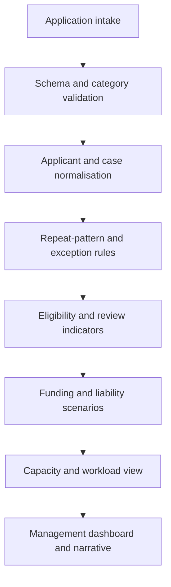

# Grant Risk & Capacity Analytics

**Evidence status:** Completed WAV and EV Power BI dashboards and operational-impact reports verified locally. Raw applicant and funding files are intentionally excluded.

## Problem

Grant rounds required a fast view of application demand, repeat activity, category consistency, eligibility signals, review workload, projected liability, available funding, and operational capacity.

The challenge was not simply producing totals. It was separating valid repeat activity from suspicious duplication, keeping category rules consistent, identifying cases that required review, and showing the operational implications of different demand scenarios.

## Solution pattern

## Analytical components

- Application and applicant-level demand
- Duplicate and repeat-pattern indicators
- Category and vehicle-type consistency
- Eligibility and manual-review flags
- Funnel and processing-stage distribution
- Requested-funding and cap checks
- Scenario-based liability and budget comparison
- Workload and resource-planning implications

## Control design

Rules were treated as review signals rather than automatic allegations or final eligibility decisions. The analytical layer supported prioritisation, while ambiguous cases remained in a human-review path.

## Outcome

The dashboards and narrative reports translated applicant-level records into decision-ready risk, funding, and workload views. The work demonstrates data profiling, rule design, scenario modelling, reconciliation, visual communication, and operational planning.

## Publication boundary

Original files contain applicant/case references, financial and tax-related review fields, internal assumptions, organisation branding, and operational recommendations. A portfolio version must use wholly fictional applicants and figures and must not reproduce internal thresholds or source structures verbatim.

