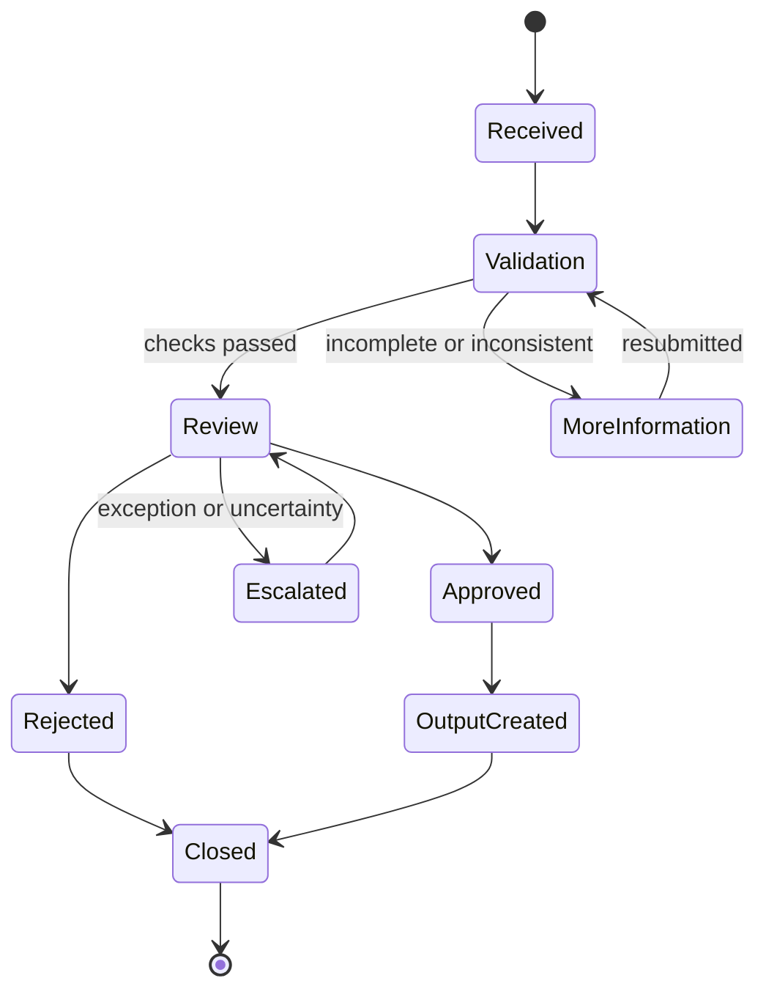

# Licence-Renewal Workflow Design

**Evidence status:** Delivery is documented in the user's project CV, but the original process diagram and implementation artifacts were not found during the local, Drive, thread-history, and GitHub audit.

This page therefore records a generic design pattern. It does not claim that the original source was recovered.

## Described scope

The original work mapped a recurring renewal process across:

- Source capture
- Data and document validation
- Approvals and hand-offs
- Status transitions
- Exception and rework paths
- Review and output organisation
- Reporting requirements

## Generic workflow pattern

## Design controls

- Every status should have an owner and entry/exit criteria.
- Validation failures should be explainable and recoverable.
- Exceptions should be visible rather than hidden in free-text notes.
- Hand-offs should record time, owner, and reason.
- Reporting should distinguish waiting time from active processing time.
- Automation should not bypass approval or evidence requirements.

## Publication boundary

Internal process rules, thresholds, forms, role names, and control details are not reproduced. A future demonstrator should use a fictional renewal domain and synthetic documents.

